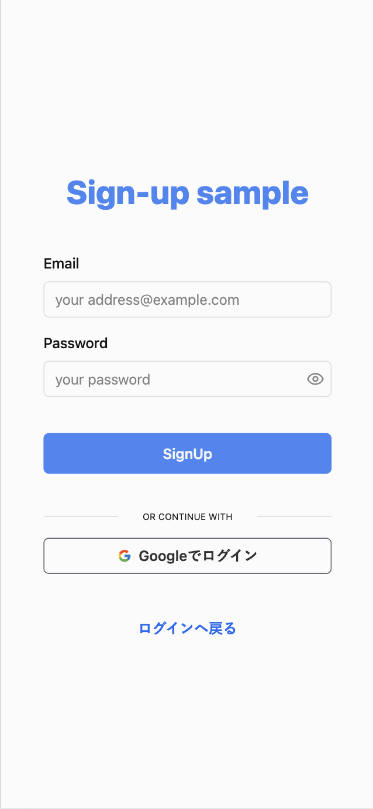
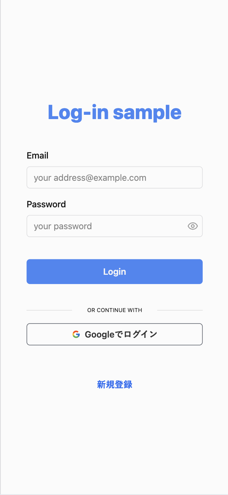

# Firebase Authを利用したログイン機能のサンプルです  

### 参考サイトURL
___
[【完全版】ReactのFirebase Authentication(認証)を基礎からマスターする](https://reffect.co.jp/react/react-firebase-auth)

### page image
___
    

### 開発環境
___
> [!IMPORTANT]
> Firebase Authenticationの以下の認証機能を利用します。
> - Email と Password
> - Googleアカウント
>
> 設定情報を.envファイルに記述する必要があります。

### 機能
___
#### sign up
新しく利用する場合は、必要なEmail、Passwordもしくは、Googleアカウントの登録して、サインアップします。  
すでに登録済のEmail、Googleアカウントがある場合は、エラー表示が出ます。  
Passwordは６文字以上が必要です。

#### log in
登録済みの情報を入力することでログインできます。  
入力情報が間違っているとエラー表示が出ます。  

#### top page
ログイン状態になると、画面表示されます。  
ログイン状態でない場合は、自動的にログインページにリダイレクトされます。  
ログアウトボタンを押すと、ログアウトできます。
